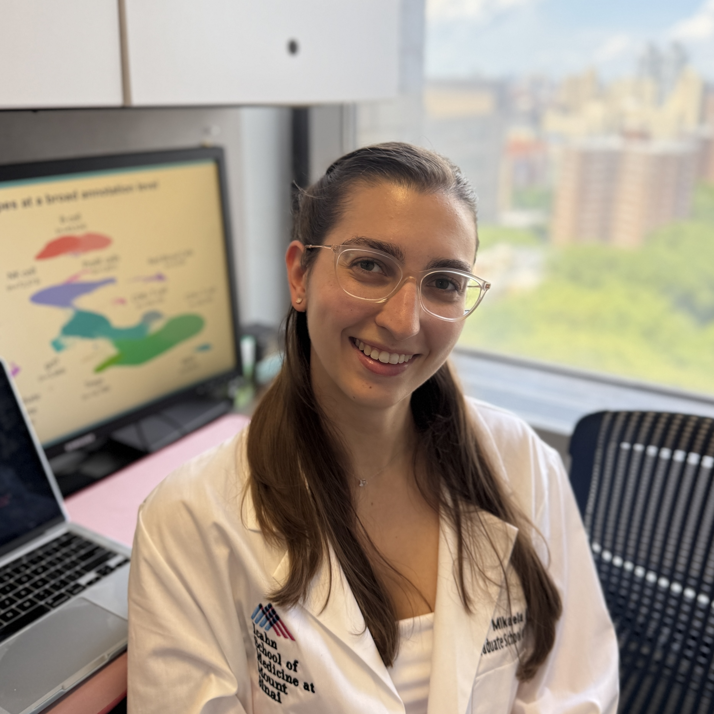

## About Me

I graduated with a PhD in Biomedical Sciences ([Genetics and Genomic Sciences](https://icahn.mssm.edu/research/genomics)) from the Icahn School of Medicine at Mount Sinai (ISMMS), advised by Dr. [Towfique Raj](https://scholar.google.com/citations?user=_1soEyEAAAAJ&hl=en) ([Raj Lab @ MSSM](https://rajlab.org/)). My research focused on understanding the genetic and peripheral immune components of Parkinson's disease (PD) using computational approaches including single-cell RNA sequencing and expression quantitative trait loci analysis.

I earned a Bachelor's of Science degree in Biology, specializing in Computational Biology, with honors from the [University of Richmond](https://www.richmond.edu). I completed research for all four years of my undergraduate education, studying the biochemical characteristics and molecular dynamics of protein superfamiles. 

## Contact

<a href="mailto:mikaela.rosen.perez@gmail.com" title="Email">
  <i class="fa-solid fa-envelope"></i>
</a>

&nbsp;·&nbsp;

<a href="https://orcid.org/0000-0001-5941-8485" title="ORCID">
  <i class="fa-brands fa-orcid"></i>
</a>

&nbsp;·&nbsp;

<a href="https://github.com/rosenm" title="GitHub">
  <i class="fa-brands fa-github"></i>
</a>

&nbsp;·&nbsp;

<a href="https://www.linkedin.com/in/mikaela-rosen-perez" title="LinkedIn">
  <i class="fa-brands fa-linkedin"></i>
</a>

## Research highlights

<table>
  <tr>
    <td width="140">
      
    </td>
    <td>
      <strong><a href="/research#scRNA-seq">scRNA-seq atlas in PD</a></strong>
      Large-scale comprehensive single-cell RNA sequencing and T-cell receptor analysis of the peripheral immune system in PD
    </td>
  </tr>

  <tr>
    <td width="140">
      
    </td>
    <td>
      <strong><a href="/research#eQTL">eQTL analysis</a></strong>
      <em>cis</em>-QTL analysis of peripheral gene expression, T-cell receptor gene usage and HLA gene expression.
    </td>
  </tr>

  <tr>
    <td width="140">
      
    </td>
    <td>
      <strong><a href="/research#protein-MD">Protein molecular dynamics</a></strong>
      Classification and characterization of the Arsenate reductase protein superfamily using molecular dynamics simulations.
    </td>
  </tr>

</table>

## Explore

- [Research](/research) — Current and past projects
- [Activities](/activities) — News, teaching, outreach, and memberships
- [Achievements](/scicomm) — Awards and honors
- [Beyond research](/beyond-research) — Outside the lab

### License

[GNU GPL v3](https://github.com/bk2dcradle/researcher/blob/gh-pages/LICENSE)
